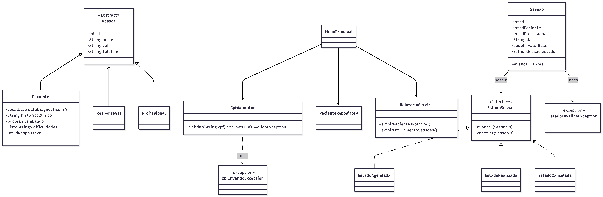

# 🏥 EvoluTEA - Sistema de Gestão Terapêutica (TEA)

[](https://www.oracle.com/java/)
[](https://opensource.org/licenses/MIT)

## 📋 Visão Geral
O **EvoluTEA** é uma solução de software robusta, desenvolvida para gerir o ciclo de vida de atendimentos clínicos especializados em TEA. A arquitetura prioriza a rastreabilidade clínica e a segurança de transações, utilizando padrões de projeto avançados para garantir escalabilidade e manutenção simplificada.

## 🏛️ Modelagem do Sistema
O projeto foi modelado seguindo os princípios **SOLID**, com foco no desacoplamento entre a camada de persistência (`Repository Pattern`) e a lógica de negócio (`State Pattern`).

### Diagrama de Classes (UML)
O diagrama abaixo detalha a estrutura de classes, o gerenciamento de estados das sessões e as dependências de persistência do sistema:



## ⚙️ Arquitetura e Regras de Negócio
1. **Máquina de Estados (State Pattern):** As transições de `Sessao` (Agendada, Realizada, Cancelada) são protegidas por lógica de negócio encapsulada. Tentativas de transições inválidas disparam a exceção personalizada `EstadoInvalidoException`.
2. **Polimorfismo:** O cálculo de honorários é tratado via interface `CalculadorHonorario`, permitindo a extensibilidade de regras de remuneração sem alterar o núcleo do sistema.
3. **Persistência:** Utilização de persistência em arquivos (`Flat File Database`), garantindo a integridade dos dados entre execuções.
4. **Validação:** Implementação de `CpfValidator` para assegurar a conformidade dos dados de entrada na origem, utilizando tratamento de exceções robusto.

## 🛠️ Tecnologias Utilizadas
* **Linguagem:** Java (JDK 11+)
* **Paradigma:** Orientação a Objetos (POO)
* **Design Patterns:** State, Repository, Factory.
* **Automação:** Makefile
* **Controle de Versão:** Git/GitHub

## 🚀 Guia de Execução
Este projeto utiliza um `Makefile` para automatizar o ciclo de build. Certifique-se de ter o `make` instalado em seu sistema Linux.

### 1. Compilar o projeto:
```bash
make compile

2. Executar o sistema:
make run

3. Limpeza (Clean):
Para remover os arquivos compilados (.class):
make clean

👥 Integrantes
Talisson Oliveira

Allson Lobato

Projeto desenvolvido para a Atividade da Unidade 03 - Professor Jefferson Gomes Dutra.